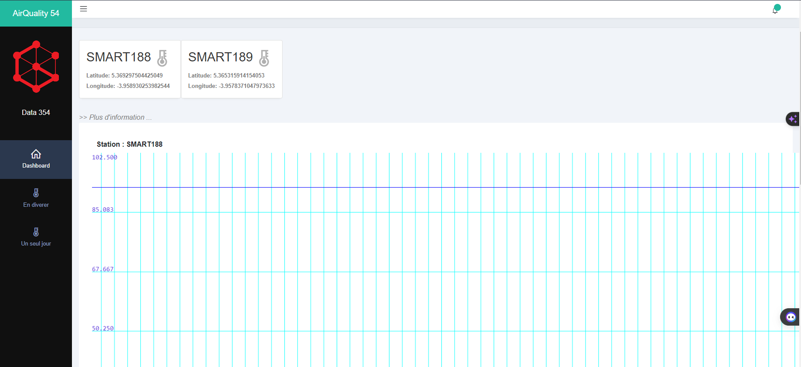
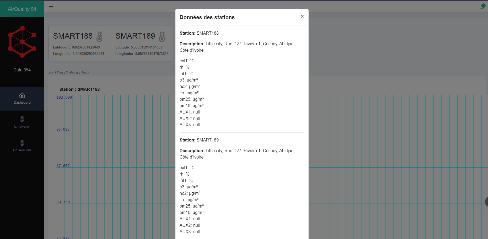
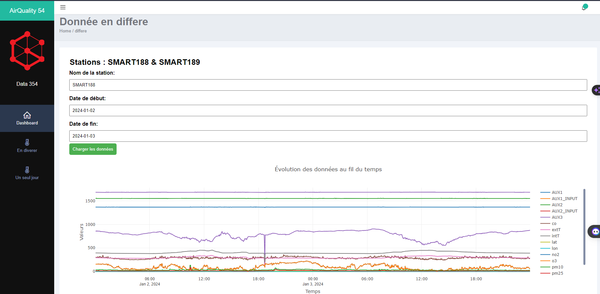
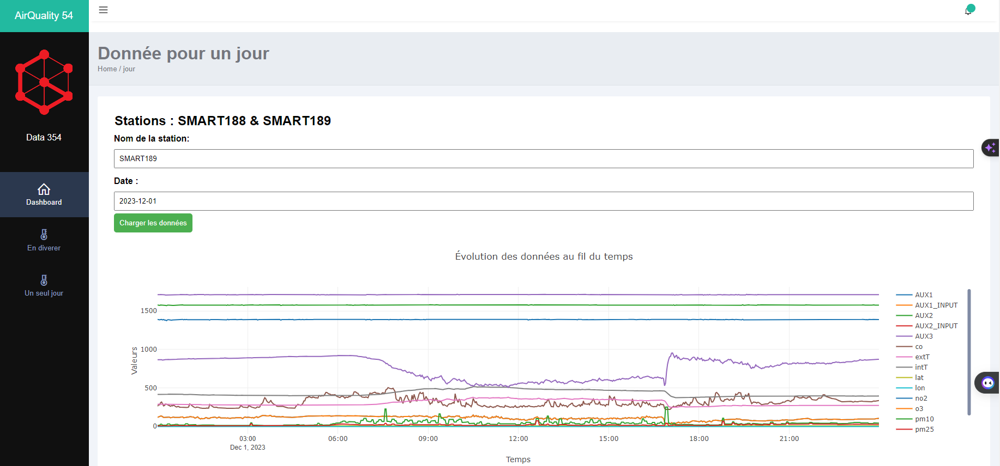

# AQ54 project : plateforme de visualisation de données 

AQ54 < Air Quality 54 > est un projet d’étude de la qualité de l’air à Abidjan. Il consiste à déployer des capteurs dans la ville dans le but de mesurer la quantité de particules fines dans l’air.

Pour mener à bien ce projet, data354 utilise Aquino, une plateforme de surveillance environnementale de haute précision, développée par le Conseil national italien de la recherche (CNR) en collaboration avec TEA Group et Quanta Srl.

Nous disposons donc de deux capteurs Airqino déployés  en zone urbaine dans le but de collecter des données dans un périmètre de 300m et les analyser par la suite.


## Fonctionnalites principales

- Visualisation de donnée en temps réel (Capteurs: SMART188 & SMART189)
- Visualisation de donnée en differe (Capteurs: SMART188 & SMART189)
- Visualisation de donnée pour un jour en particulier (Capteurs: SMART188 & SMART189)
- Information sur les capteurs: SMART188 & SMART189


## Quelques captures d'ecran










## Execution

- le lien du site hebergé : https://issiaka002.github.io/AQ54-project-sidibe-issiaka/
- une seule commande : 
    + docker run --name myapp -ti -p 8088:80 -d issiaka99/aq54:latest
- un docker-compose.yml:
```bash
    version: '3'
		services:
  			myWebApp:
    			image: issiaka99/aq54:latest
    			ports:
      				- "8081:80"
```
	+ docker-compose up -d

### Equipement utilisés

Machine Locale:

```bash
  Windows 11
  16 GiB RAM, 500 GiB Storage SSD
```

### prerequis

- Docker (optional)
- un navigateur web 

## Perspective futures

On peut considerer ses perspective futures suivantes :

- Implementer un system d alert en temps real pour notifier les utilisateur
- Analyse & machine learning

## Conclusion

Ce projet montre l'utilisation de javascript vanilla pour mettre en place une plateforme de visualisation de donnée en temps réel et en differe
